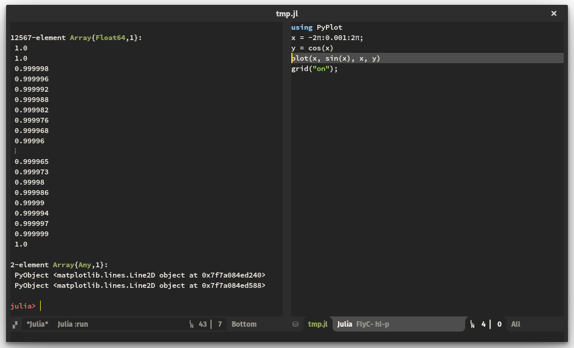

# julia-shell-mode
### Emacs major mode for an interactive [Julia](http://julialang.org/) shell


## Introduction

`julia-shell-mode` provides a comfortable [Julia](http://julialang.org/) REPL
in an interactive Emacs buffer. Some of the features include `TAB` completion
through the Emacs completion system and easy interaction between a
[`julia-mode`](https://github.com/JuliaLang/julia/blob/master/contrib/julia-mode.el)
editing buffer and a live `julia-shell` REPL.

## Features/Usage

### Completions

To query Julia for completions of the current command on the prompt, simply hit
`TAB`. This supports LaTeX substitutions, just like the native Julia shell. For
example, hitting `TAB` after

```julia
julia> y + \Delta
```

Completes to
```julia
julia> y + Δ
```
just like in the native Julia REPL.

When not substituting LaTeX letters, `julia-shell` will open a buffer with
suggestions on how to complete the current command using Emacs' completion
system. Simply press `TAB` to get a list of suggestions. For example, pressing
`TAB` after

```julia
julia> his
```

First completes to
```julia
julia> hist
```

And pressing `TAB` again opens up a new `*Completions*` buffer with the
following suggestions:

```
Click on a completion to select it.
In this buffer, type RET to select the completion near point.

Possible completions are:
hist 	hist2D
hist2d 	histrange
```

### Shell interaction from `julia-mode`

You can use the function `julia-shell-run-region-or-line` to send the current
region to the Julia interpreter. If the region is not active, this function
will send the current line.

Another handy function is `julia-shell-save-and-go`: Save the current buffer
and evaluate it in the Julia shell using `evalfile()`.

## Installation

Put the following code in your `.emacs`, `init.el`, or equivalent:
```elisp
(add-to-list 'load-path "path-to-julia-shell-mode")
(require 'julia-shell)
```
where `"path-to-julia-shell-mode"` should be the location of this archive.

To interact with `julia-shell` from
[`julia-mode`](https://github.com/JuliaLang/julia/blob/master/contrib/julia-mode.el),
add the following code to your init.el:
```elisp
(defun my-julia-mode-hooks ()
  (require 'julia-shell-mode))
(add-hook 'julia-mode-hook 'my-julia-mode-hooks)
(define-key julia-mode-map (kbd "C-c C-c") 'julia-shell-run-region-or-line)
(define-key julia-mode-map (kbd "C-c C-s") 'julia-shell-save-and-go)
```

## Acknowledgments

This mode borrows heavily from
[MATLAB-emacs](http://matlab-emacs.sourceforge.net/) and hopes to replicate the
comfortable MATLAB shell experience using Julia. Thanks!

Furthermore, thanks to the devs of
[the original julia.el](https://github.com/JuliaLang/julia/blob/master/contrib/julia-mode.el)
for laying the foundation of this, especially the neat LaTeX substitutions.

## License

[GPL v2](https://www.gnu.org/licenses/old-licenses/gpl-2.0.en.html)
